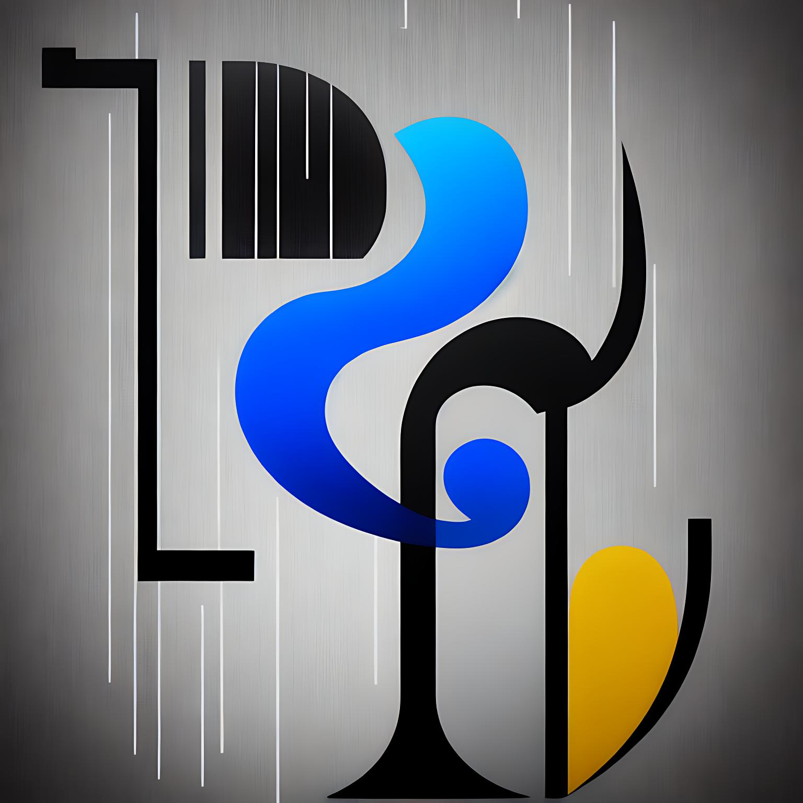

# BEAT~LYTICA

This project implements a real-time event streaming pipeline for a music streaming service, inspired by Spotify Wrapped and Billboard charts. The pipeline is powered by Apache Airflow, Apache Kafka, dbt, Docker, GCP, Spark-Streaming, and Terraform.

## Table of Contents

- [BEAT~LYTICA](#beatlytica)
  - [Table of Contents](#table-of-contents)
  - [Introduction](#introduction)
    - [Dataset](#dataset)
  - [Requirements](#requirements)
  - [Installation](#installation)
  - [Setup](#setup)
    - [Pre-requisites](#pre-requisites)
    - [Get Going!](#get-going)
  - [Usage](#usage)
    - [Debug](#debug)
  - [Contributing](#contributing)

## Introduction

BEAT~LYTICA is a project designed to create a live dashboard for a fake music streaming service, similar to Spotify. The pipeline streams events generated by user interactions, such as listening to a song, navigating the website, and authenticating. The real-time data is processed and stored in a data lake periodically (every two minutes). An hourly batch job consumes this data, applies transformations, and creates the desired tables for the dashboard to generate analytics. The goal is to analyze metrics like popular songs, active users, and user demographics.

### Dataset

The project uses [Eventsim](https://github.com/Interana/eventsim), a program that generates event data to replicate page requests for a fake music website. The generated data mimics real user data but is entirely synthetic. The Docker image for Eventsim is borrowed from [\[viirya's fork\]](https://github.com/viirya/eventsim), as the original project has not been maintained for several years.

Eventsim utilizes song data from the [Million Songs Dataset](http://millionsongdataset.com) to generate events.

## Requirements

- Apache Airflow
- Apache Kafka
- dbt
- Docker
- Google Cloud Platform (GCP)
- Spark-Streaming
- Terraform

## Installation

## Setup

**NOTE: Google Cloud Platform will charge for the infrastructure based on the usage. You can feel free to create a new and free GCP account and access $300 worth of credit to run this project and others.**

### Pre-requisites

If you already have a Google Cloud account and a working terraform setup, you can skip the pre-requisite steps;

- Google Cloud Platform.
- [GCP Account and Access Setup](setup/gcp.md)
- [gcloud alternate installation method - Windows](https://github.com/DataTalksClub/data-engineering-zoomcamp/blob/main/week_1_basics_n_setup/1_terraform_gcp/windows.md#google-cloud-sdk)
- Terraform
- [Setup Terraform](https://github.com/DataTalksClub/data-engineering-zoomcamp/blob/main/week_1_basics_n_setup/1_terraform_gcp/windows.md#terraform)

### Get Going!

   - Procure infrastructure on GCP with Terraform - [Setup](terraform/terraform.md)

- (Extra) SSH into your VMs, Forward Ports - [Setup](setup/ssh.md)

- Setup Kafka Compute Instance and start sending messages from Eventsim - [Setup](kafka/kafka.md)

- Setup Spark Cluster for stream processing - [Setup](spark_streaming/spark.md)

- Setup Airflow on Compute Instance to trigger the hourly data pipeline - [Setup](airflow/airflow.md)

## Usage

### Debug

If you run into issues, see if you find something in this debug [guide](setup/debug.md).

## Contributing

Guidelines for contributing to the project, such as submitting issues, creating pull requests, or any other relevant information, will be provided here.

